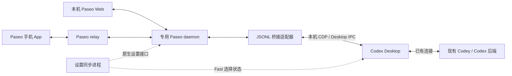

# Codey ↔ Paseo Bridge

项目版本：**`0.0.1`**，对应 Git 标签 `0.0.1`。

**让 Paseo 网页和手机 App 接入当前 Codey 启动的 Codex 后端，继续同一会话。**

本项目通过本机 Codex Desktop 已有的连接转发请求与事件，保留后端提供的 FastCtx、Codey 子代理及运行时配置，并补充模型、推理强度和 Fast 状态同步。电脑上的 Codey / Codex Desktop 需要持续运行。

> 当前定位：Windows 本机集成原型。已在指定版本组合上完成验证，依赖 Desktop 内部接口，升级应用后需要重新核对兼容性。

## 目录

- [功能与边界](#功能与边界)
- [工作原理](#工作原理)
- [环境要求](#环境要求)
- [版本兼容性](#版本兼容性)
- [快速开始](#快速开始)
- [手机连接与历史会话](#手机连接与历史会话)
- [设置同步规则](#设置同步规则)
- [启动参数](#启动参数)
- [运行数据与隐私](#运行数据与隐私)
- [常见问题](#常见问题)
- [开发与验证](#开发与验证)

## 功能与边界

| 能力 | 当前行为 |
| --- | --- |
| 复用后端 | 使用 Codey 启动的现有 Codex app-server，适配器不创建另一个后端 |
| 网页与手机接入 | 本机使用 Paseo Web，手机通过 Paseo relay 配对连接 |
| Codey 能力 | 启动时核验 FastCtx、具名子代理和 Codey 运行时指令 |
| 历史会话 | 通过 Paseo 导入已有 Codex 会话，恢复后订阅后续事件 |
| 模型与推理强度 | 按会话同步实际轮次使用的设置 |
| Fast | 同步 Desktop 原生选择状态，并根据后端模型目录补齐支持的模型开关 |
| 独立运行目录 | 专用 daemon 使用项目内的 `.paseo-codey/` |
| 启停管理 | 提供双击入口；停止专用 daemon 时保留 Codey 后端 |

权限设置仍由各客户端及后端的原生机制处理，本项目没有实现权限选择器的完整双向同步。Fast 的界面状态和请求选择不代表上游实际加速或计费结果已经验证。

## 工作原理



Paseo 的 Codex provider 启动轻量 JSONL 适配器。适配器通过本机 CDP 调用 Desktop 的 Electron 消息桥，由 Desktop 原来的连接转发请求；返回事件再送回 Paseo。

物理后端连接由 Desktop 管理。适配器只维护自己的请求、事件订阅和逻辑握手；断开适配器不会关闭 Desktop 后端。连接或能力验证失败时会报错，不会自动切换到普通 Codex 后端。

设置同步是独立进程：它增量读取会话轮次元数据，通过 Paseo 的原生设置接口更新模型和强度，并访问当前 Desktop 原生 Fast 选择状态。

## 环境要求

| 组件 | 运行要求 |
| --- | --- |
| 系统 | Windows，能够运行 PowerShell 和 CMD |
| Node.js | 启动脚本要求 22 或更新版本 |
| Codey | 已通过 Codey 启动 Codex Desktop |
| Paseo | 已安装桌面程序，使用其自带运行时和依赖 |
| Codex CLI 后端 | 由 Codey / Desktop 启动，并具有 Codey 运行时能力 |
| Codex Desktop | 已开启本机 CDP 调试端口，并具有 Codey 注入的连接与作用域发现能力 |

无需为本仓库执行 `npm install`。主脚本使用 Node.js 内置模块，Paseo 客户端依赖由已安装的 Paseo 提供。Fast 兼容钩子还需要 Paseo 自带的 Node 运行时支持 `module.registerHooks`。

启动脚本会检测现有进程和调试端口，但不会替你安装应用或开启 Desktop 的调试端口。

## 版本兼容性

**本项目按完整版本组合验证，不声明兼容所有更高版本。** 运行要求中的最低 Node 版本不等于对任意 Codey、Paseo 或 Desktop 版本的兼容承诺。

当前验证基线（2026-09-10）：

| 组件 | 已记录版本 |
| --- | --- |
| Codey | `v0.10.8`，由使用者确认并补入验证记录 |
| Paseo 桌面程序 / daemon | `0.7.2` |
| Codex CLI 后端 | `0.153.4` |
| 桌面应用 | ChatGPT（Powered by Codex & OWL）`26.903.61454`，由使用者确认 |

本文中的 Codex Desktop 指上述 ChatGPT 桌面应用提供的 Codex 界面。对外兼容记录使用 ChatGPT 应用版本；它与 Codex CLI 后端版本分别记录，不能互相替代。

该组合已验证基础桥接、历史恢复、模型与推理强度传递，以及原生 Fast 开关双向同步。手机扫码与发送消息已验证；设置修复后的全部手机显示场景、上游实际加速和计费结果尚未验证。

新版本默认标记为 **未验证**，不直接视为不兼容。若只有部分功能因升级失效，标记为 **部分兼容** 并列明影响；确认核心连接不可用后才标记为 **不兼容**。

完整功能矩阵、历史组合和升级验证方式见 [COMPATIBILITY.md](COMPATIBILITY.md)。项目自身的版本号独立管理，每个 Release 应注明实际验证的组合；Codey 或 Paseo 升级不会自动扩大已有验证范围。

## 快速开始

### 1. 准备应用

1. 使用 Codey 打开 Codex Desktop，保持它运行。
2. 首次使用时先打开 Paseo，便于脚本识别安装位置。
3. 在项目目录打开 PowerShell，确认 Node 可用：

```powershell
node --version
```

Node 不在 PATH 中时，可为 CMD 入口设置环境变量 `REM_CODEY_NODE`，值为 Node 可执行文件位置；不要将个人安装路径写入受版本管理的脚本。

### 2. 检查连接

```powershell
node tools/launch_paseo_codey.mjs --check-only
```

这一步核验现有 Codey 后端，不启动或停止 daemon。若检测到多个 Desktop 实例，使用 `--cdp-port` 选择目标。

### 3. 启动专用服务

双击 **`启动-Paseo-Codey.cmd`**，或运行：

```powershell
node tools/launch_paseo_codey.mjs
```

脚本核验后端后，启动专用 daemon 与设置同步进程，并打开 Web 页面。默认本机入口：

```text
http://127.0.0.1:17677
```

以终端实际打印的入口为准。重复启动会复用已运行的专用 daemon；关闭命令行窗口后，服务继续运行。首次创建的专用配置只启用 Codex provider。

### 4. 停止服务

双击 **`停止-Paseo-Codey.cmd`**，或运行：

```powershell
node tools/launch_paseo_codey.mjs --stop
```

专用 daemon 停止后，同步进程随后退出。Codey / Codex Desktop 及其后端保持运行，专用目录里的历史和配对信息保留。

## 手机连接与历史会话

### 手机配对

1. 启动专用 daemon，打开它的 Paseo Web 页面。
2. 在 Web 页面启用 relay，并查看配对二维码。
3. 使用手机 Paseo App 扫码，连接这套专用服务。

首次启动时也可直接启用 relay 并打印配对信息：

```powershell
node tools/launch_paseo_codey.mjs --relay
```

如果专用 daemon 已运行且 relay 尚未启用，直接使用 Web 开关即可；命令行改配置被拒绝时，先停止专用 daemon 再重新启动。relay 开关会持久化，之后启动会保留它的设置。

原 Paseo 应用和旧手机配对可能连接另一套 daemon。应以本项目启动时打印的入口、专用服务身份和二维码为准。

### 导入历史

在 Paseo 中使用 **Import session / 导入会话**，选择 Codex 和需要继续的历史会话。列表可能按工作目录筛选，已导入的会话应从现有工作区进入。

共享后端不会自动让所有历史出现在 Paseo 列表里。导入建立会话关联；恢复时，桥接会在读取线程和发送请求前注册事件订阅，以接收后续输出。

## 设置同步规则

| 设置 | 同步时机 | 作用范围 |
| --- | --- | --- |
| 模型 | 发送消息后，以实际轮次记录为准 | 当前会话 |
| 推理强度 | 发送消息后，以实际轮次记录为准 | 当前会话 |
| Fast | 原生选择或 Paseo 开关发生变化后 | Desktop 全局选择，联动专用 daemon 中已打开且支持 Fast 的 Codex 会话 |

同步进程每轮检查结束后等待约 1.5 秒。本机实测设置变化通常约 1.5–3 秒反映到另一端；这不是网络或模型响应时延保证。

**只改模型或推理强度下拉框、尚未发送消息时，另一端不一定立即变化。** 同步进程保存已处理轮次，避免把未发送的新选择反复覆盖为上一轮的设置。

Fast 使用 Desktop 的原生选择状态，因为启动参数可能覆盖 `config/read` 返回的 `service_tier`。Paseo 切换 Fast 时，同步进程会同时更新 Codex 对应配置和 Desktop 原生选择。同一次检查发现两端同时改 Fast 时，优先采用 Desktop 的变化。

Paseo 0.7.2 的 Fast 支持判断使用固定模型前缀。专用 daemon 的加载钩子改用当前后端 `model/list` 返回的支持目录，使目录中支持 Fast 的 Astra 等模型显示原生开关；不会修改原 Paseo 安装包。

## 启动参数

以下参数适用于 `node tools/launch_paseo_codey.mjs`，也可通过 CMD 入口传入。

| 参数 | 用途 |
| --- | --- |
| `--check-only` | 只核验现有后端 |
| `--no-browser` | 启动后不自动打开浏览器 |
| `--relay` | 启用持久化 relay 配置并打印手机配对信息 |
| `--port <端口>` | 指定专用 daemon 本机端口，默认 17677 |
| `--cdp-port <端口>` | 选择检测到的 Codey Desktop 调试端口 |
| `--paseo-exe <程序位置>` | 手动指定 Paseo 可执行文件 |
| `--stop` | 停止专用 daemon |
| `--help` | 显示简要帮助 |
| `--no-pause` | CMD 入口退出时不等待按键，必须放在第一个参数位置 |

```powershell
# 启动但不打开浏览器
node tools/launch_paseo_codey.mjs --no-browser

# 更换运行中的监听端口前，先停止专用 daemon
node tools/launch_paseo_codey.mjs --stop
node tools/launch_paseo_codey.mjs --port 17678

# 从 CMD 入口调用，不等待按键
& '.\启动-Paseo-Codey.cmd' --no-pause --no-browser
```

## 运行数据与隐私

运行数据保存在项目内的 `.paseo-codey/`，已整体加入 `.gitignore`。

| 文件 | 内容 |
| --- | --- |
| `config.json` | 专用 daemon 与 provider 配置 |
| `connection.json` | 检测到的程序位置、端口、进程信息及验证时间 |
| `fast-models.json` | 后端返回的 Fast 支持模型目录 |
| `settings-sync.pid.json` | 设置同步进程状态 |
| `settings-sync-state.json` | 已处理轮次与设置同步水位 |
| `logs/bridge.jsonl` | 桥接请求和事件元数据 |
| `logs/settings-sync.jsonl` | 设置同步操作及错误 |

**配对 URL、二维码及运行目录中的身份数据应作为访问凭据保护。** 不要公开分享，也不要强制加入 Git。

日志默认以元数据为主，但错误信息仍可能包含本地路径；发布故障报告前需要脱敏。历史取证资料、旧 PoC 配置和机器专用调查脚本保留在本地，不随仓库分发。普通停止或重启服务不需要删除运行目录。

本机服务和 CDP 使用环回连接；手机接入走 Paseo 的配对与 relay 流程。不要为了手机连接而直接向公网暴露 CDP。

## 常见问题

### 提示找不到 Codey 后端或 Desktop 页面

确认 Desktop 是通过 Codey 启动的，且已开启本机 CDP。脚本还会核验 FastCtx、具名子代理和运行时指令；普通 Codex 实例可能无法通过检查。多个实例同时运行时，用 `--cdp-port` 选择。

### 找不到 Paseo 或 Node

先打开已安装的 Paseo 再启动脚本，或使用 `--paseo-exe` 指定安装程序。Node 需要位于 PATH；使用双击入口时也可配置 `REM_CODEY_NODE`。

### 提示端口被占用或运行中的配置发生变化

检查是否连接了另一套服务。使用其他端口前，先停止本项目的专用 daemon，再带 `--port` 启动。脚本不会终止其他占用端口的进程。

### relay 开关提示由启动覆盖参数控制

当前启动器将 relay 开关保存在配置中，不向 daemon 传入 `--relay` / `--no-relay` 覆盖参数，并清除继承的 `PASEO_RELAY_ENABLED`。若服务由旧脚本启动，停止专用 daemon 后用当前脚本重新启动。

### Paseo 的模型或推理强度没有立即变化

先确认是否已经发送消息，以及两端是否打开同一个导入会话。模型和强度按实际轮次同步；仅修改下拉框不等于已经更新后端轮次。需要进一步排查时查看 `logs/settings-sync.jsonl`。

### Astra 没有 Fast，或应用升级后 Fast 同步报错

确认连接的是本项目的专用 daemon。首次加载兼容钩子需要重启专用 daemon。若日志出现 `Desktop settings adapter needs review` 或模块结构不匹配，需要复核新版本的适配；不要通过移除校验强行宣称兼容。

### 运行中追加的消息在另一端较晚显示

界面提交时间、后端接纳时间和另一端显示时间可能不同。运行中追加的消息可能等待后端处理点；排查时应比较后端消息事件、桥接接收记录和客户端时间，而不是仅根据分钟级时间标签判断桥接延迟。

## 下载与自动发布

Release 中的 `codey-link-<版本>-windows.zip` 包含启动入口、运行源码、README、兼容性记录及记录 tag / commit 的 `release.json`。完整解压后按本文准备 Node.js、Paseo 和 Codey Desktop，再双击启动入口；这是源码运行包，不包含第三方程序。`SHA256SUMS.txt` 可用于核对下载文件。

[Release workflow](.github/workflows/release.yml) 在推送版本标签（如 `0.0.2`、`v0.0.2` 或 `0.0.2-rc.1`）时执行测试、打包并发布。带后缀的版本标为预发布。每次打标签前：

1. 更新 README 中的项目版本，以及 `COMPATIBILITY.md` 的当前项目基线、验证日期、组件版本和功能范围；保留历史记录。
2. 提交后创建同版本 tag，并推送 tag。标签版本（去掉可选的 `v`）必须与兼容性文件的当前基线一致，否则打包失败。
3. 在 Actions 的 Release 运行记录中检查结果，然后查看对应 Release 附件和适配说明。

Release 说明直接摘录**目标标签内**的当前验证记录及功能矩阵，不会用主分支的新记录覆盖旧版本结论。打包采用明确文件清单，排除本机配置、配对凭据、会话、取证文件和辅助提取工具。

已有 `0.0.1` 标签早于 workflow。workflow 推送到默认分支后，可在 **Actions → Release → Run workflow** 选择主分支，填写 `0.0.1` 补发；无需移动或重新创建标签。流程先创建草稿并上传附件，再公开发布；若已有同名 Release 则失败，避免覆盖资产。如果发布失败留下草稿，检查原因后删除该草稿再重跑，保留 Git tag。

本地预览打包（需要 Python 3.9+ 和 Git，不连接运行中的服务）：

```powershell
python scripts/build_release.py --tag 0.0.1 --output dist
python -m unittest discover -s tests -p 'test_release.py' -v
```

产物位于被 Git 忽略的 `dist/`。新增运行模块时同步维护打包脚本的 `FILES` 清单。

## 开发与验证

项目源码布局：

架构决策、方案取舍与验证结论见 [Agent Note](.agents/notes/implemented/architecture/2026-09-10-shared-codey-desktop-bridge.md)。提交的 note 使用仓库相对路径，并移除机器身份与真实会话标识；原始取证资料仍保留在被忽略的本地目录中。

```text
.
├── 启动-Paseo-Codey.cmd
├── 停止-Paseo-Codey.cmd
├── tools/
│   ├── launch_paseo_codey.mjs    # 启停、安装检测、后端能力核验
│   ├── cdp.mjs                  # 本机 CDP 连接
│   ├── desktop_bridge.mjs       # Desktop 请求与事件转发
│   ├── paseo_desktop_shim.mjs   # Paseo JSONL 适配器
│   ├── paseo_settings_sync.mjs  # 轮次读取与设置同步进程
│   ├── settings_sync_policy.mjs # 同步变化判断
│   ├── desktop_settings.mjs     # Desktop 原生 Fast 状态适配
│   ├── paseo_native_client.mjs  # 原生 Paseo 设置客户端
│   ├── paseo_compat.mjs         # Fast 模型目录兼容钩子
│   └── asar_inspect.py          # 只读提取安装包指定文件
└── tests/
    └── settings-policy-check.mjs
```

运行不连接应用服务的策略测试：

```powershell
node tests/settings-policy-check.mjs
```

测试覆盖实际轮次变化、未发送选择保护、Fast 标识判断，以及轮次文件的增量读取和截断处理。安装包检查辅助工具使用 Python；普通启动不依赖 Python。

已进行本机共享后端、历史恢复、模型与强度双向传递、原生 Fast 开关双向同步的集成验证。私有会话记录不随仓库分发；策略测试不能替代手机实际显示、上游加速效果和其他应用版本的验收。

提交前检查改动与暂存范围：

```powershell
git diff --check
git diff --cached
git status --short
```
